<!-- .slide: data-background="./assets/front_page_background.png" -->

 
**Carlos Nunez**
*2019 October 21*

Note:
Hi! Thanks for coming to my talk! I'm glad that you're here, and I hope you're having a great day.
I'm going to be talking about the relationship between SRE and BDD.

These slides are up on GitHub! If you have any questions, hang around after the talk and I'll be
glad to answer them. I also have these slides and code samples on GitHub; links at the end.

---

## Left column
- Bullet 1
- Bullet 2
- Bullet 3
- Even [links](https://www.google.com)

## Right colum
1. List
2. List
3. 

---

# Hello, I'm Carlos

Note:
My name's Carlos Nunez. I've been a systems administrator and software engineer for over 10 years.
While I'm currently at a hip DevOps consultancy from New York called Contino, I've worked for many
companies: large, small, regulated and wild-west.

I love talking and doing all things DevOps. When I'm not doing that, I'm enjoying beer, my bike, my
wife, my gym or travels somewhere.

---

# Agenda

Note:
This is what I'd like to talk about today:

- What is `$F`Reliability Engineering, and why it matters
- What is Behavior Driven Development, and why it matters
- The relationship between `$F`RE and BDD
- An example of this relationship manifested.

---

# `$foo`Reliability Engineering

Notes:
Let's talk about Site Reliability Engineering, or, as I call it, `$foo` Reliability Engineering.

---

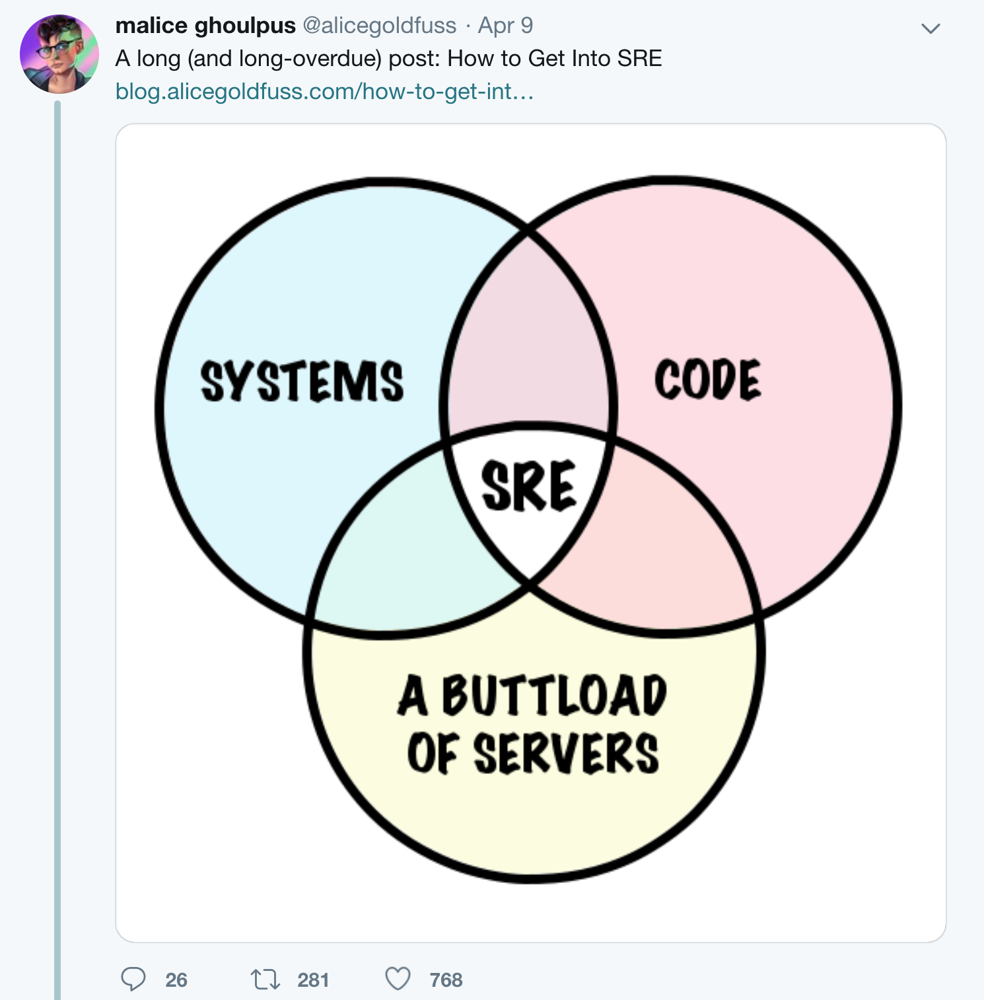

Notes:

- Spent a lot of time trying to find a cool sentence explaining what RE is
  that _didn't_ come from Google.

- Had a _surprisingly_ rough time of it, so I started saving all of the sites that explained it
  well enough and created a quick word cloud with it.

- But I ran into this image that explained it really well with no words at all..MY FAVORITE

- Reliability Engineering is really what you get when you take code, systems and
  a lot of infrastructure and put it together. It's a bit more nuanced than that, though.

---

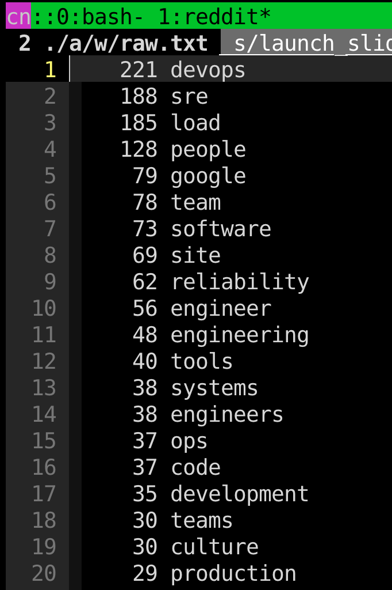

Notes:

- ...hence the frequency map
- Here are the top 20 most frequent words I saw from reading Reddit posts, Quora
  articles and other things from the interwebs on RE (excluding utterances)
- (Pages used and script that generated this in the GitHub repo)

---

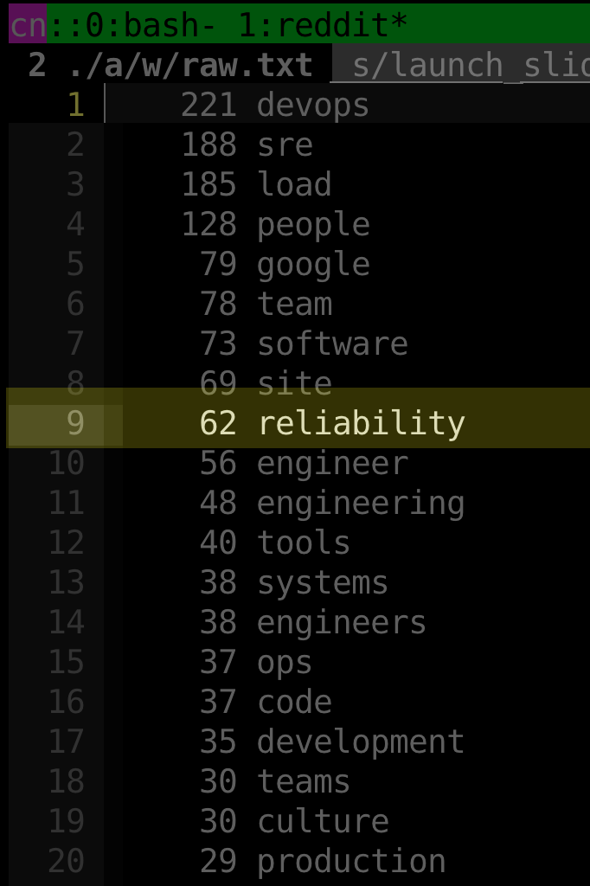

- `$f`RE is about reliability of a thing (hence `$foo`)
  - Site is popular because Google made it so, but even they have different
    RE for things like Cloud and CorpEng.

---

Notes:
- Read the definition
- "Consistently performing well"...this is defined by customers of your thing!
- This is where SLAs, SLOs, SLIs, and error budgets come into play

---

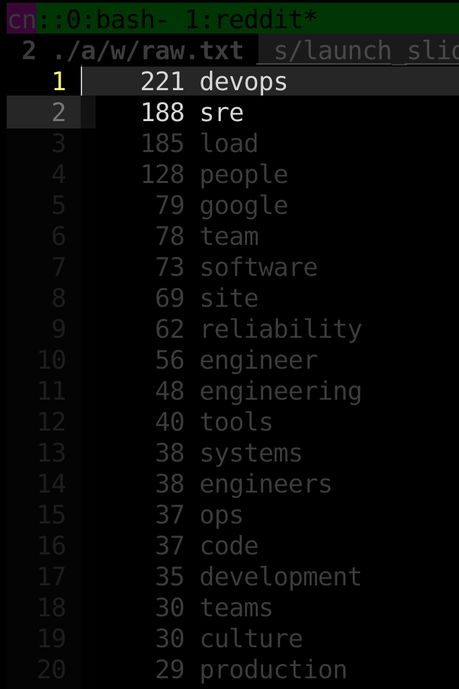

Notes:
- For some reason, there's a debate on RE vs. DevOps
- It's more like RE _is_ DevOps

---

Notes:
- DevOps is about bringing people together: from the Dev side and the Ops side
- DevOps is about bringing dev and ops together to help achieve business goals
- RE literally brings dev and ops together through reliability; see BUTTLOAD OF SERVERS

---

# BDD

Notes:
Let's talk about BDD.

---

Notes:

- Agile is about bringing teams together to collaborate on shipping value quickly
  and painlessly to better serve customers with ever-changing needs
- But teams may speak different languages:
  - Product speaks through documentation
  - Engineering speaks through code
  - Design speaks through wireframes
- This can add friction through translation, since context can get lost in the shuffle

---

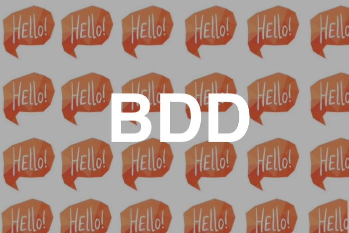

Notes:

- Behavior Driven Development helps remove the friction through an English-like langauge
  that expresses business needs through code.
- This helps everyone speak a common language by making everything expressable as code

---

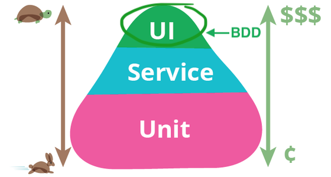

Notes:

- The test pyramid. You can't escape it.
- BDD also helps automate (or at least accelerate) user acceptance testing, which is a key
  part of releasing software that is often the most manual and the least transparent.
- BDD is also a natural starting point for a user story; the story isn't
  moved into a Ready state until an acceptance test has been authored...ideally by the
  Product team!

---

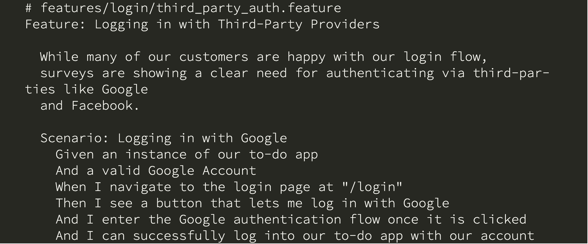

Notes:

- Here's an example of BDD in action.
- We're using Cucumber in this case; a popular framework for acceptance testing.
- Behave is another alternative, though you can also leverage popular testing
  frameworks for this at the expense of readability (biggest reason why I
  love Cucumber)
- As you can see, this looks exactly like acceptance criteria that you might
  see in a user story. Anyone can write this.

---

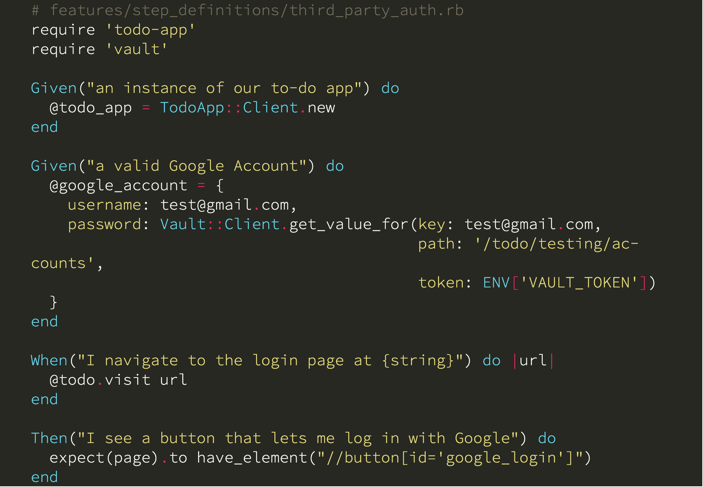

Notes:

- All of the action happens under the hood.
- Engineers take the plain English specification and produce failing step definitions
- The story isn't done until the acceptance tests pass _and_ the Product team
  confirms that the behavior shown from the acceptance tests matches their acceptance
  criteria.

---

# 🤔
# RE and BDD?

Notes:

- So how in the world does RE relate to BDD?

---

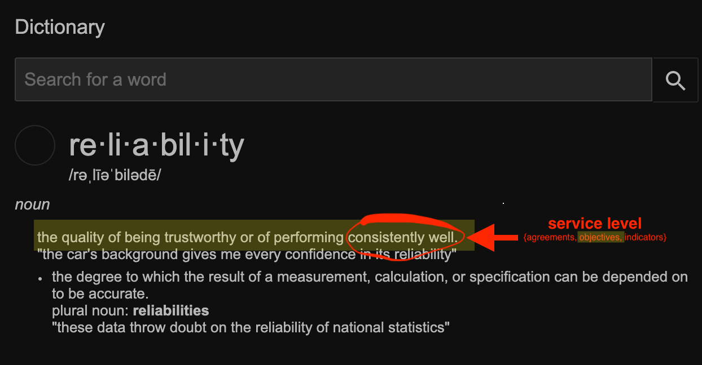

Notes:

- Earlier, I brought up the three core Reliability metrics: SLAs, SLIs and SLOs.
- These metrics are related
- SLIs are the metrics that inform the SLOs, which are created by Reliability and Product
  to establish SLAs that provide reliability guarantees for customers

---

Notes:
- In other words, the SLO is the bridge between product and engineering!
- It's an important one too, since poor reliability leads to customers not coming back!

---

Notes:
- In other _other_ words, it's a potential point of miscommunication
- Engineering speaks code
- Product speaks documentation

---

Notes:
- We solved this already for software development by writing acceptance tests using BDD
- What if we solved for authoring SLOs...through acceptance tests written with BDD?

---

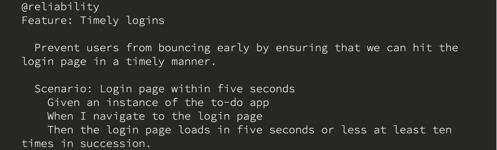

Notes:
- It could look something like this!

---

Notes:
- If you're an RE, you're probably wondering "I can already do this with Prometheus"
- Of course you can; if that works for you, awesome!
- What I'm saying is: does the left look more readable to you than the right?
- Which one would be easier for the Product team to write?

---

Notes:
- Two things to notice:
- 1. These can live in the same codebase as the software whose reliability is under test,
     but can be filtered through tags such as the `@reliability` one here
- 2. The test looks exactly like what you might see in a SLO document. No guesswork
     needed.

---

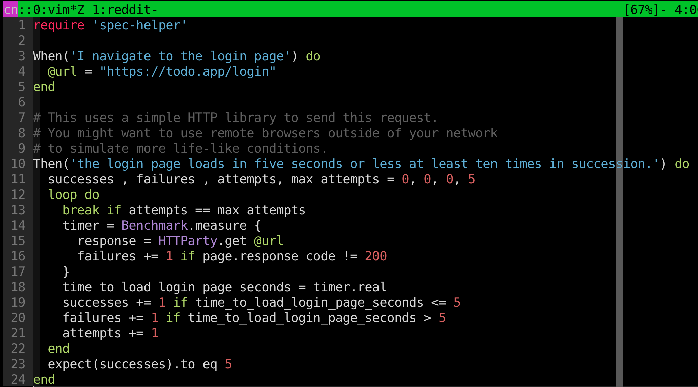

Notes:

- Just like our software acceptance tests, all of the action here happens under the hood
  through step definitions.

---

Notes:

- This becomes even more effective when run through an automated pipeline
- You can configure your build runner to dispatch alerts whenever the error rate
  for your reliability tests drops below the target for that SLO

---

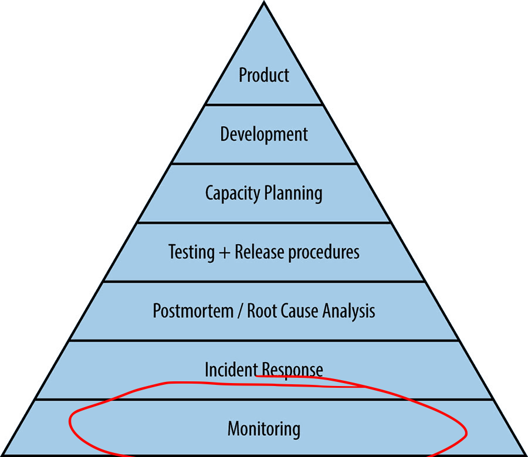

Notes:

- Observability is still key, however!
- You need tooling that can measure your SLIs and other nuances that impact
  reliability
- Observability also helps squash problems before they even become problems
- The `$f`RE pipeline is more of a first-line-of-defense (or meta-monitoring) that
  can quell issues in your systems before they threaten your reliability targets.

---

# Thanks! 👏

**Blog**: https://blog.carlosnunez.me

**Commence Pitchfork Gathering Here**: http://twitter.carlosnunez.me
